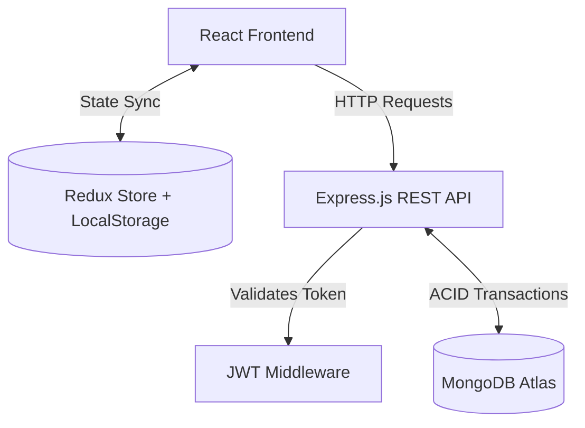
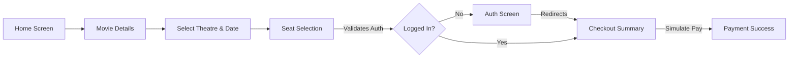

# Creative Upaay - Movie Ticket Reservation System

This repository contains the complete implementation for the Creative Upaay Full Stack Development Assignment. The application is a mobile-first (390px max-width) movie ticket reservation system that handles the entire booking lifecycle—from movie discovery to strict concurrency control during seat allocation.

## Architectural Diagrams

### System Architecture


### Application Flow


## System Architecture

### 1. State Hydration & Synchronization (Frontend)
The frontend utilizes a hybrid state management approach. **Redux Toolkit** serves as the central source of truth for the active booking session (selected movie, theatre, showtime, and seats). 
To ensure the booking journey survives accidental page refreshes, the Redux store is subscribed to a custom middleware that continuously synchronizes the `bookingState` tree to `localStorage`. Upon initialization, the store seamlessly rehydrates from the disk, ensuring a zero-data-loss user experience.

### 2. Transactional Concurrency Control (Backend)
Handling simultaneous bookings for the same seat (race conditions) is the most critical challenge in ticketing systems. Instead of introducing an external dependency like a Redis cluster for distributed locking, this system leverages **MongoDB Native Atomic Operators** combined with **ACID Transactions**.

When a user submits a booking:
1. A MongoDB `Session` is initiated.
2. The system attempts an atomic `findOneAndUpdate` on the `Showtime` collection, explicitly utilizing the `$nin` operator. 
3. The query strictly requires that *none* of the requested seats currently exist in the `occupiedSeats` array. 
4. If the atomic lock succeeds, the seats are instantly pushed into the array, and the `Booking` document is generated.
5. If any validation or the simulated payment gateway fails during this process, `session.abortTransaction()` is invoked. The lock is immediately released, rolling back the state and returning the seats to the available pool.

### 3. Authentication Routing Gateway
To prevent forcing unauthenticated users out of their booking flow, the application utilizes a dynamic React Router interceptor. Unauthenticated users attempting to proceed to checkout are safely diverted to the `/auth` route with their intended destination stored in `location.state.returnUrl`. Upon successful JWT validation, they are seamlessly injected back into the exact step they left off.

## Tech Stack

- **Client:** React.js, Tailwind CSS (Custom Design System), Redux Toolkit, React Router DOM
- **Server:** Node.js, Express.js
- **Database:** MongoDB, Mongoose
- **Security:** JSON Web Tokens (JWT), bcryptjs

## Feature Implementation Matrix

| Requirement | Status | Technical Implementation Detail |
| :--- | :---: | :--- |
| **Pixel-Perfect UI Constraints** | Complete | Strict adherence to the 390px mobile-view limit using Tailwind utility constraints. |
| **Grid Coordination** | Complete | Dynamic 2D array generation supporting Rows A-M and Columns 1-12 with mathematically driven flex layouts. |
| **Dynamic Calculation Panel** | Complete | Derived state calculations bound to Redux payload updates for instant, lag-free UI reactivity. |
| **Auth Gateway (Level 2)** | Complete | JWT-based auth layer with local token persistence and secure API middleware verification. |
| **MongoDB Integration (Level 2)**| Complete | Master state isolation; the client is strictly a presentation layer, while DB holds the ultimate source of truth. |
| **Simulated Payments (Level 2)** | Complete | Async payment mock with deliberate artificial latency and complex form schema validation. |
| **Booking History (Bonus)** | Complete | RESTful `GET /api/bookings/my` endpoint with `populate()` to retrieve relational movie and theatre metadata. |

## Local Development Setup

### 1. Environment Configuration
Create a `.env` file in the `/server` directory:
```env
PORT=5000
MONGO_URI=<your_mongodb_atlas_or_local_connection_string>
JWT_SECRET=<your_secure_jwt_secret>
```
*(Optional)* In the `/client` directory, you may provide a `.env` file with `VITE_API_URL=http://localhost:5000` to override the default localhost behavior.

### 2. Initialize the Backend
```bash
cd server
npm install
npm start
```

### 3. Initialize the Client
Open a secondary terminal:
```bash
cd client
npm install
npm run dev
```

## Reviewer Sandbox
To bypass the registration flow and directly evaluate the checkout pipeline, you may use the following provisioned credentials:
- **Email:** `demo@demo.com`
- **Password:** `123456`


